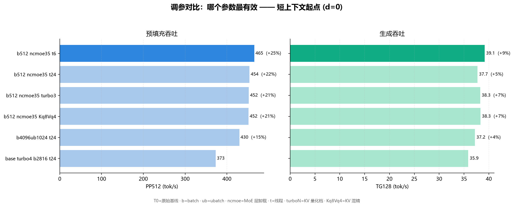

# KAT-Coder-V2.5-Dev 35B · 8GB 笔记本实测调参 + 多轮工具循环修复

> EN: KAT-Coder-V2.5-Dev 35B on 8GB laptop: depth curves, thinking-governance flags (--reasoning-budget 2048 + preserve), multi-round tool-loop fix, and an agentic bench (SWE-fix/CLI-write/log-analysis) graded objectively.

[](LICENSE)

**硬件**：RTX 4060 Laptop 8GB · 32GB DDR5 双通道 · Windows 11 · llama.cpp 系 fork

**量化**：APEX I-Compact（15.4 GB, Kuaishou Kwaipilot）

**引擎**：**AtomicBot b10269-1.6.0** + 思考治理三件套
> `--reasoning on --reasoning-budget 2048 --reasoning-budget-message "..." --reasoning-preserve`（有界思考：不会吃光输出配额，长会话保留思考轨迹）




**哪个参数最有效**：六组配置在短上下文下的对比。`b512 ncmoe35 t6` 相比基线预填充 +25%。原始数据见 `data/data_matrix`。

## 生产配置（start.bat 即仓库内同名文件，零漂移）

```bat
-ctk turbo4 -ctv turbo4 -b 2816 -ub 2816 --threads 24 --no-mmap --mlock --cache-prompt --ctx-checkpoints 8 --spec-type none --reasoning on --reasoning-budget 2048 --reasoning-preserve --jinja
```

## 实测结果（服务端真实长提示口径）

| 深度 | PP (tok/s) | TG (tok/s) |
|---|---|---|
| 0 (818 tok) | 517 | **41.3** |
| 32K (34K) | 1057 | 31.75 |
| 65K (69K) | 890 | 25.96 |
| 96K (103K) | 766 | 20.63 |
| 118K (124K 冷灌) | **850**（全程平均） | 21.1 |

## 关键发现

- KAT 官方无 MTP 头（mtp_num_hidden_layers=0），混合卸载下投机解码为负——spec 关掉。
- 思考治理三件套解决两件事：思考预算耗尽时正文被吞（budget-message 过渡语兜底）+ 长会话忘掉自己之前想过什么（preserve 保留轨迹）。
- 代理式 bench 实测（Pi 编码代理、客观脚本判分）：SWE 修 bug ✅、写 CLI 8/8 项对拍 ✅；算法题（T3）是真实短板，0/6。
- 换引擎必扫线程：老引擎矩阵的 t6 在新构建上深层 TG -12%，t24 追平（21.1 vs TQP 21.21）。
- 冷灌 0→124K 全程平均 PP 850，超过 TQP 同口径 823（+3%）。

## 复现

```bash
python tools/depth_probe_atomic.py <模型.gguf> <端口> <标签> --depths 0,32768,65536,98304,118784 -ctk turbo4 -ctv turbo4 -b 2816 -ub 2816 --threads 24
python tools/test_engines.py
```

## data/ 与 tools/

`data/` 是全部实测数据（summary_*.txt 为权威深度/预填/矩阵总表，每行带时间戳，可复现）。
`tools/` 是探针与判分脚本（服务端真实长提示口径；llama-bench pp512 在本机与真实负载差 2.8 倍，仅作参考）。

## 姊妹仓库（同机同方法论）

- [ornith-1.5-35b-8g-tuning](https://github.com/rui08984-dot/ornith-1.5-35b-8g-tuning)
- [qwen3.6-35b-8g-tuning](https://github.com/rui08984-dot/qwen3.6-35b-8g-tuning)
- [bonsai2-27b-8g-tuning](https://github.com/rui08984-dot/bonsai2-27b-8g-tuning)
- [zhrp-gemma4-26b-8g-tuning](https://github.com/rui08984-dot/zhrp-gemma4-26b-8g-tuning)
- [ornith-9b-kvmem-8g-tuning](https://github.com/rui08984-dot/ornith-9b-kvmem-8g-tuning)

## 致谢

- [ggml-org/llama.cpp](https://github.com/ggml-org/llama.cpp) — 本体
- [TheTom/llama-cpp-turboquant](https://github.com/TheTom/llama-cpp-turboquant) — turbo4 KV 原始 fork
- [AtomicBot-ai/atomic-llama-cpp-turboquant](https://github.com/AtomicBot-ai/atomic-llama-cpp-turboquant) — 现用构建
- [PrismML](https://huggingface.co/PrismML) — Bonsai 三值 QAT
- KVMem — KV-in-RAM 超长上下文引擎

## License

MIT。模型权重遵循各自发布页许可。
